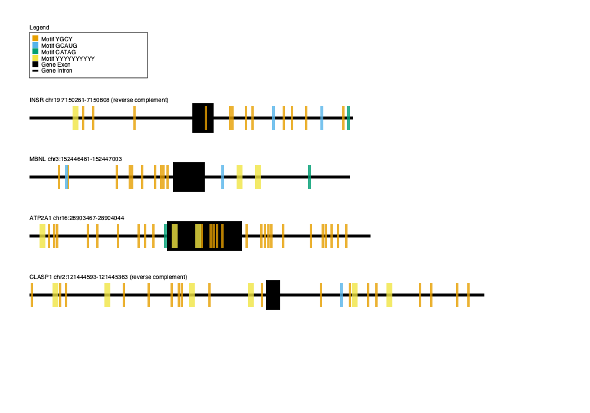

# OOP Motif Mark
Using object-oriented code to visualize motifs on sequences. 

Input: 
    - FASTA file, does not need to be one-line format
    - motifs file, one motif per line

Output: One png file per FASTA file

Package requirements: cairo, argparse, re, os

## Summary

This repository contains a python script with object-oriented code to visualize motifs on sequences. The script takes two argparse options: 
    - -f: fasta file
    - -m: motifs file

The limit on FASTA file contents is currently maximum 1000 bases per sequence, and the limit on motifs file is maximum 10 bases per motif. In terms of file sizes, a maximum of 10 sequences per FASTA file and a maximum of 5 motifs per motif file can be utilized by this script. In order to correctly differentiate between exons and introns, the exon portion must be in all uppercase and the intron in all lowercase.

This script is capable of handling motifs with ambiguous nucleotides. Overlapping motifs in the sequence will be indicated by overlapping highlights in the figures, as each motif is indicated using rectangles with a bit of transparency. 

### Example Output

